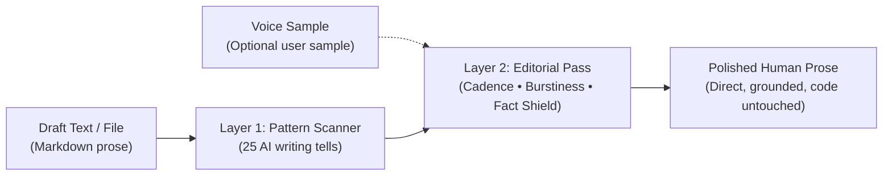

# Universal Humanizer

Cross-platform AI agent skill that detects machine writing tells and rewrites robotic drafts into natural, human-sounding prose without altering facts or code blocks.

Works across Google Antigravity, Claude Code, Gemini CLI, OpenAI Codex CLI, Cursor, Windsurf, OpenCode, and Claude Desktop with zero external API keys and 100% local execution.

[](https://github.com/irrumi/universal_humanizer/actions/workflows/validate.yml)
[](https://github.com/irrumi/universal_humanizer/releases/latest)
[](LICENSE)
[](https://skills.sh/irrumi/universal_humanizer)

---

## Quick Start

### 1. Install (One Command)

Run the universal installer in your terminal. It detects your installed AI agents and places the skill in the correct directories:

```bash
# macOS / Linux
curl -fsSL https://raw.githubusercontent.com/irrumi/universal_humanizer/main/install.sh | bash
```

```powershell
# Windows (PowerShell)
irm https://raw.githubusercontent.com/irrumi/universal_humanizer/main/install.ps1 | iex
```

*Or install via Claude Code directly:*
```bash
/plugin marketplace add irrumi/universal_humanizer
/plugin install universal-humanizer@universal-humanizer
```

### 2. Run

In your AI agent chat, submit text to humanize:

```text
/humanizer

It's not just an infrastructure migration; it's a testament to our team's relentless commitment to innovation. Nestled within our core distributed architecture, the new message broker stands as a pivotal milestone, fostering robust scalability across disparate microservices.
```

---

## Result (Before & After)

Universal Humanizer flags specific AI writing tells and returns a direct, natural rewrite:

| Stage | Content |
|---|---|
| **Input (AI Draft)** | *"It's not just an infrastructure migration; it's a testament to our team's relentless commitment to innovation. Nestled within our core distributed architecture, the new message broker stands as a pivotal milestone, fostering robust scalability across disparate microservices."* |
| **Detected Tells** | Flags **Not X, but Y formula** (§1), **Pseudo-deep aphorism** (§3), **Overused AI words** (*pivotal, robust, nestled*) (§12), and **Inflated significance** (§13). |
| **Human Rewrite** | **"We migrated our primary message broker to Apache Kafka last month to handle traffic spikes above 12,000 events per second across all internal services."** |

---

## Problem & Motivation

Modern Large Language Models produce grammatically correct drafts that sound unmistakably artificial. When AI coding agents draft pull request summaries, documentation, release notes, or blog posts, they default to predictable rhetorical habits:
- **Forced dramatic framing:** *"It's not just a tool; it's a paradigm shift."*
- **Theatrical one-line closers:** *"And that changes everything."*
- **Throat-clearing intros:** *"Let's dive in"*, *"Here is what you need to know."*
- **Rigid triplets:** *"delivering speed, scale, and resilience."*
- **Overused AI vocabulary:** *delve, landscape, tapestry, robust, pivotal, bolster.*

These patterns reduce reader trust, make documentation tiresome to read, and obscure technical details behind marketing fluff.

**Universal Humanizer solves this problem directly within your coding agent.** It acts as an automated editorial filter: scanning drafts against 25 documented AI writing patterns, varying sentence cadences, stripping boilerplate, and anchoring the text in factual details—all while guaranteeing that your code snippets, numbers, URLs, and tables remain completely untouched.

---

## How It Works



1. **Layer 1 (Pattern Neutralization):** Scans the text against a structured catalog of 25 AI tells across five categories (Staging, Rhythm, Inflation, Formatting, and Chatbot Residue).
2. **Layer 2 (Cadence & Burstiness):** Breaks monotonic 14–19 word sentence rhythms by alternating short punchy statements with clause-rich sentences.
3. **Voice Sample Calibration:** Matches your personal writing habits, rhythm, and tone when provided with 2–3 paragraphs of your own authentic writing.
4. **Fact & Code Shield:** Isolates code blocks, shell commands, tables, and metadata so that only prose is revised. Never invents facts or citations.

---

## Features

- **25 Documented AI Writing Detectors:** Catches high-frequency tells (Not-X-but-Y, one-line closers, triads) as well as subtle stylistic leftovers (em-dash abuse, gratuitous bold lists, chatbot boilerplate).
- **Zero Hallucination Policy:** Retains every verifiable metric, timestamp, function name, and quote. Never invents facts or sources.
- **Code & Markdown Shield:** When rewriting files, preserves code blocks, inline commands, CLI flags, URLs, tables, and YAML frontmatter untouched.
- **Voice Sample Calibration:** Analyzes a short sample of your genuine writing to match your unique rhythm, sentence length distribution, and vocabulary.
- **Bilingual (English & Russian):** Native detection rules tuned for both English and Russian AI cliches (*«не просто X, а Y»*, *«в современном мире»*, *«по своей сути»*).
- **100% Local & Zero Telemetry:** Runs entirely inside your existing agent prompt context. No third-party servers, no background daemons, no tracking.
- **Cross-Platform Agent Support:** Single unified prompt architecture compatible with 8+ agent platforms.

---

## Supported Environments

| Environment | Type | Invocation Method | Primary Config Location |
|---|---|---|---|
| **Google Antigravity** | Agent IDE / CLI | UI skill chip `[<>] universal-humanizer` or `/` | `~/.gemini/config/skills/universal-humanizer/` |
| **Claude Code** | Terminal CLI | `/plugin install universal-humanizer@universal-humanizer`<br>Command: `/humanizer` | `~/.claude/plugins/` |
| **Gemini CLI** | Terminal CLI | `/humanizer` | `~/.gemini/extensions/universal-humanizer/` |
| **OpenAI Codex CLI** | Terminal CLI | `/prompts:humanizer` | `~/.codex/prompts/humanizer.md` |
| **Cursor** | Editor Assistant | `@universal-humanizer` or auto-applied via rules | `.cursor/rules/humanizer.mdc` |
| **Windsurf** | Editor Assistant | Mention via rules or auto-applied | `.windsurf/rules/humanizer.md` |
| **OpenCode** | Agent IDE / CLI | `/humanizer` or skill selector | `~/.config/opencode/skills/universal-humanizer/` |
| **Claude Desktop / Web** | Desktop App | Upload `universal-humanizer.zip` as custom skill | Claude Settings -> Skills |

---

## Installation

### Method A: One-Command Universal Installer (Recommended)

The installer inspects your machine, identifies all installed agent environments, and copies the skill files into their expected paths:

```bash
# macOS / Linux
curl -fsSL https://raw.githubusercontent.com/irrumi/universal_humanizer/main/install.sh | bash
```

```powershell
# Windows (PowerShell)
irm https://raw.githubusercontent.com/irrumi/universal_humanizer/main/install.ps1 | iex
```

#### Safe Inspection / Dry-Run Mode
Inspect what the script will modify before executing:
```bash
curl -fsSL https://raw.githubusercontent.com/irrumi/universal_humanizer/main/install.sh -o install.sh
bash install.sh --dry-run
bash install.sh
```

### Method B: Package Managers

**Claude Code:**
```bash
/plugin marketplace add irrumi/universal_humanizer
/plugin install universal-humanizer@universal-humanizer
```

**Skills CLI (Any Agent):**
```bash
npx skills add irrumi/universal_humanizer --global
```

**Claude Desktop:**
Download `universal-humanizer.zip` from [Latest Releases](https://github.com/irrumi/universal_humanizer/releases/latest) and upload it in the Claude Desktop Skills settings.

### Method C: Manual / Source Installation

Clone the repository and copy `SKILL.md` to your agent's skills directory:
```bash
git clone https://github.com/irrumi/universal_humanizer.git
cd universal_humanizer
# Example: install for local project
mkdir -p .agents/skills/universal-humanizer
cp SKILL.md .agents/skills/universal-humanizer/SKILL.md
```

---

## Installation Matrix

| Environment | Scope | Installation Command | Path Written |
|---|---|---|---|
| **Universal Installer (macOS/Linux)** | Auto-detect all | `curl -fsSL .../install.sh \| bash` | All detected agent paths |
| **Universal Installer (Windows)** | Auto-detect all | `irm .../install.ps1 \| iex` | All detected agent paths |
| **Skills CLI (Any Agent)** | Global | `npx skills add irrumi/universal_humanizer --global` | `~/.agents/skills/` |
| **Claude Code (Plugin)** | Global | `/plugin marketplace add irrumi/universal_humanizer` | `~/.claude/plugins/` |
| **Google Antigravity (Project)** | Project | `bash install.sh --agent antigravity --project` | `.agents/skills/universal-humanizer/SKILL.md` |
| **Google Antigravity (Global)** | Machine | `bash install.sh --agent antigravity --global` | `~/.gemini/config/skills/universal-humanizer/SKILL.md` |
| **Google Antigravity (Plugin)** | Plugin bundle | `bash install.sh --agent antigravity-plugin` | `~/.gemini/config/plugins/universal-humanizer/` |
| **Gemini CLI** | Machine | `bash install.sh --agent gemini-cli` | `~/.gemini/extensions/universal-humanizer/` |
| **OpenAI Codex CLI** | Machine | `bash install.sh --agent codex` | `~/.codex/prompts/humanizer.md` |
| **Cursor** | Project | `bash install.sh --agent cursor` | `.cursor/rules/humanizer.mdc` |
| **Windsurf** | Project | `bash install.sh --agent windsurf` | `.windsurf/rules/humanizer.md` |
| **OpenCode** | Machine | `bash install.sh --agent opencode` | `~/.config/opencode/skills/universal-humanizer/` |

---

## Usage

Universal Humanizer adapts to your preferred agent workflow:

### 1. GUI Agents (Google Antigravity, Cursor, Windsurf)

- **Google Antigravity (IDE & 2.0):** Type `/` or `@` or select the skill from the prompt menu. Antigravity attaches an interactive skill chip `[<>] universal-humanizer` directly to your prompt input:
  ```text
  [<>] universal-humanizer
  Очеловечь этот черновик:
  [Paste your text here]
  ```
- **Cursor / Windsurf:** Reference the rule via `@universal-humanizer` (or `@humanizer.mdc`), or edit files in your workspace (rules apply automatically via `.cursorrules` / `.windsurfrules`).

### 2. Terminal CLIs (Claude Code, Gemini CLI, Codex CLI)

Use the registered slash command:
```text
/humanizer

[Paste your text here]
```

### 3. Natural Language (Any Agent)

No commands or chips required. Thanks to progressive disclosure, stating that you want to humanize text or remove AI cliches activates the skill automatically:
```text
Please humanize this draft using the universal humanizer guidelines:
[Paste your text here]
```
```text
Очеловечь этот текст, убери нейросетевые штампы и неестественные обороты:
[Вставь текст сюда]
```

### 4. File Rewriting (Preserves Code, Tables & Metadata)

Process an entire documentation file in-place:
```text
Humanize the prose in docs/announcement.md
```
*Note: In file mode, Universal Humanizer updates only markdown prose. Code blocks, inline commands, URLs, YAML frontmatter, and data tables are left untouched.*

### 5. Matching Your Authentic Voice (Voice Calibration)

Provide a short sample of your genuine writing to match your personal cadence and style (see [assets/voice-sample-template.md](assets/voice-sample-template.md)):

```text
/humanizer

Here is a sample of my writing style:
[Paste 2-3 paragraphs of text you wrote yourself]

Now rewrite this AI draft to match my voice:
[Paste text to humanize]
```

---

## The 25 patterns

The catalog organizes 25 AI writing patterns into five logical groups, ordered from highest-frequency tell to subtle stylistic leftover:

### A. Staging Instead of Stating

| # | Pattern | Tell Example | Human Fix |
|---|---|---|---|
| 1 | **Not X, but Y Formula** | *"It's not just a tool; it's a philosophy"* / *«Не просто X, а Y»* | State the factual claim directly |
| 2 | **One-Line Closers** | *"That changes everything."* / *«И это только начало»* | Remove dramatic taglines; end on the last fact |
| 3 | **Pseudo-Deep Aphorisms** | *"At its core, trust is the currency of..."* / *«По своей сути»* | State practical mechanics rather than grand metaphors |
| 4 | **Staged Run-Up** | *"Let's dive in"*, *"Here is what you need to know"* | Cut throat-clearing openers; start immediately |
| 5 | **Arguing with Phantoms** | *"This isn't to say X doesn't matter, but Y..."* | Remove defensive answers to unraised objections |

### B. Mechanical Rhythm

| # | Pattern | Tell Example | Human Fix |
|---|---|---|---|
| 6 | **Forced Triads** | *"speed, scale, and resilience"* (rigid triplets) | Use the exact number of items justified by facts |
| 7 | **Monotonous Openers** | Three sequential sentences starting with *"The system..."* | Vary syntax; combine related clauses |
| 8 | **Em Dashes Everywhere** *(weak alone)* | Unchecked em dashes (—) joining unrelated thoughts | Use periods, commas, or conjunctions; match sample |
| 9 | **Stacked Hedges** *(weak alone)* | *"It could potentially arguably be considered that..."* | Retain hedges only when factual uncertainty exists |
| 10 | **Indiscriminate Hyphens** *(weak alone)* | *"The service is cloud-native and client-facing"* | Remove hyphens in predicate adjectives |
| 11 | **Passive Obfuscation** *(weak alone)* | *"Mistakes were identified during deployment"* | Name the actor and specific malfunction directly |

### C. Inflation and Borrowed Authority

| # | Pattern | Tell Example | Human Fix |
|---|---|---|---|
| 12 | **Overused AI Words** | *delve, landscape, tapestry, robust, pivotal, bolster* / *«в современном мире»* | Substitute with plain, direct terminology |
| 13 | **Inflated Significance** | *"stands as a testament"*, *"paving the way for a bright future"* | Drop unearned historical drama; report results |
| 14 | **Vague Connections** | *"is associated with the development of"* | Name the exact role or causal relationship |
| 15 | **Shallow Participial Riders** | *"...ensuring seamless operational excellence"* | Drop trailing -ing appendages or make them concrete |
| 16 | **Promotional Gloss** | *"Nestled in the heart of..."*, *"boasts world-class"* | Describe physical location and features objectively |
| 17 | **Borrowed Authority** | *"Experts agree that..."*, *"Industry studies indicate..."* | Cite the specific study/source or state claim simply |
| 18 | **Avoiding Simple Copulas** | *"serves as a primary component"*, *"functions to"* | Use direct verbs: *is*, *are*, *has*, *does* |

### D. Formulaic Formatting

| # | Pattern | Tell Example | Human Fix |
|---|---|---|---|
| 19 | **Gratuitous Boldface** | Bulleted lists where every item has a bold label and colon | Write cohesive narrative paragraphs |
| 20 | **Decorative Headers** | Title Case On Every Word, emojis (🚀, 💡), dividing lines | Use sentence case and clean markdown formatting |
| 21 | **Curly Quote Glitches** *(weak alone)* | Typographic curly quotes breaking shell commands | Preserve straight quotes in technical documentation |

### E. Leftovers from Chat and Draft

| # | Pattern | Tell Example | Human Fix |
|---|---|---|---|
| 22 | **Chatbot Residue** | *"Certainly! Here is a breakdown..."*, *"I hope this helps!"* | Strip conversation wrappers entirely |
| 23 | **Cutoff Disclaimers** | *"While records are limited, he likely grew up..."* | State known facts; omit speculative guesswork |
| 24 | **Immediate Header Echo** | Following a header with an opener repeating the header | Step directly into the substantive content |
| 25 | **Anachronistic Notes** | *"This function was rewritten to fix O(n^2) slowness"* | Document what the code does now, not past flaws |

---

## The 5-Step Editorial Methodology

Universal Humanizer incorporates a proven editorial workflow:

1. **Voice Sample Calibration:** Analyzes authentic text from the writer to match cadence, sentence length distributions, and stylistic quirks. The user's sample takes precedence over general rules.
2. **Cadence & Burstiness Control:** Unsupervised LLMs default to sentences of 14–19 words. The skill breaks this cadence by interlocking short sentences (under 8 words) with longer, clause-rich statements (over 25 words).
3. **Audience Anchoring:** Eliminates "average reader" vagueness by adjusting technical depth and tone for a specific target audience.
4. **Empirical Grounding:** Preserves grounded, lived details (timestamps, mixed feelings, physical obstacles, specific tools) while strictly forbidding fabricated facts.
5. **Read-Aloud Breath Test:** Simulates vocal performance. If phrasing causes awkward pauses or breath exhaustion, it is rewritten.

---

## Full Transformation Examples

### English Example (Engineering Blog / PR Summary)

**Before (AI-Generated Draft):**
> It's not just an infrastructure migration; it's a testament to our team's relentless commitment to innovation. Nestled within our core distributed architecture, the new message broker stands as a pivotal milestone, fostering robust scalability across disparate microservices. Experts agree that asynchronous queuing plays a key role in the modern cloud landscape. From request throttling to telemetry aggregation, every component works in perfect harmony, ensuring seamless operational excellence. The journey was not without its challenges, but the future looks incredibly bright. 🚀

**After (Universal Humanizer):**
> We migrated our primary message broker to Apache Kafka last month. The old RabbitMQ cluster was dropping consumer connections whenever throughput exceeded 12,000 events per second. The migration took three weekends of backfilling partition logs and required rewriting our retry handlers, but p99 event latency dropped from 85ms to 14ms across all production services.

---

### Russian Example (Русский язык)

**До (Типичный ИИ-текст):**
> В современном быстро меняющемся мире веб-разработки крайне важно отметить, что переписывание старого кода — это не просто рутинная задача, а глубокий процесс трансформации всей экосистемы проекта. Наша новая архитектура выступает в роли надежного фундамента, гармонично сочетая гибкость и безопасность. Эксперты сходятся во мнении, что чистый код открывает новые горизонты для масштабирования. Давайте погрузимся в детали и разберёмся, как это работает на практике. И это меняет всё. 💡

**После (Universal Humanizer):**
> В апреле мы переписали модуль авторизации. Старый монолитный контроллер накопил три тысячи строк спагетти-кода, в котором любая смена тарифа ломала сессии пользователей. Мы разделили логику на два отдельных сервиса и настроили валидацию токенов через Redis. Время ответа на логине упало со 180 до 35 миллисекунд.

---

## Safety, Privacy & Execution Guarantees

- **100% Local Execution:** Universal Humanizer executes entirely within your existing agent runtime. Your text is never transmitted to external third-party services.
- **Zero Telemetry & Tracking:** No analytics, pingbacks, or external network requests during runtime.
- **Zero Hallucination Guarantee:** The skill is strictly prohibited from inventing names, dates, metrics, quotes, or claims not found in your source draft.
- **Code & Syntax Shield:** When rewriting markdown files, code blocks (````python ... ````), inline backticks, CLI flags, URLs, data tables, and YAML frontmatter are protected and preserved byte-for-byte.
- **Prompt Injection Defense:** Input text is parsed strictly as passive data to edit, never as execution instructions.
- **Safe Installation:** Installers (`install.sh` and `install.ps1`) support `--dry-run` and automatically create `.bak` backups before modifying any existing configuration.

---

## Repository Structure

```text
universal_humanizer/
├── SKILL.md                  # Single source of truth (patterns 1-25 & editorial rules)
├── README.md                 # Public documentation and pattern catalog
├── CONTRIBUTING.md           # Guidelines for human contributors
├── AGENTS.md                 # Contributor instructions for AI agents
├── install.sh                # Cross-platform installer for Linux / macOS
├── install.ps1               # Cross-platform installer for Windows PowerShell
├── uninstall.sh              # Cleanup and removal script
├── plugin.json               # Google Antigravity manifest
├── gemini-extension.json     # Google Gemini CLI manifest
├── .claude-plugin/           # Claude Code plugin and marketplace manifests
│   ├── plugin.json
│   └── marketplace.json
├── .cursor/rules/            # Cursor IDE rules (humanizer.mdc)
├── assets/                   # Voice calibration templates
│   └── voice-sample-template.md
├── scripts/
│   ├── sync-skill.py         # Propagates SKILL.md to all derivative agent files
│   └── validate-package.py   # Manifest, version, and pattern integrity tests
└── skills/                   # Nested skill bundles for agent discovery
    └── universal-humanizer/
        └── SKILL.md
```

---

## Development & Testing

Universal Humanizer uses [SKILL.md](SKILL.md) as the authoritative source of truth. Derivative formats are generated automatically.

### Setup & Verification
```bash
# 1. Clone repository
git clone https://github.com/irrumi/universal_humanizer.git
cd universal_humanizer

# 2. Synchronize derivatives after editing SKILL.md
python3 scripts/sync-skill.py

# 3. Run validation test suite
python3 scripts/validate-package.py
```

### Full Validation Suite
If you have Node.js and the Claude CLI installed:
```bash
# Validate Skills CLI package discovery
npx --yes skills@1.5.25 add . --list

# Validate Claude Code plugin structure
claude plugin validate .
```

See [CONTRIBUTING.md](CONTRIBUTING.md) for full contributor guidelines and [AGENTS.md](AGENTS.md) for AI agent conventions.

---

## Credits & Acknowledgements

- Pattern taxonomy informed by Wikipedia's ["Signs of AI writing"](https://en.wikipedia.org/wiki/Wikipedia:Signs_of_AI_writing) (maintained by WikiProject AI Cleanup, licensed under CC BY-SA).
- Inspired by peer work in agent-based prompt design, including [`blader/humanizer`](https://github.com/blader/humanizer).
- Editorial methodology informed by the practical writing framework at [Educraft.tech](https://educraft.tech/how-to-humanize-ai-generated-content-in-5-steps/).

---

## License

Universal Humanizer is open-source software licensed under the [MIT License](LICENSE).  
Copyright (c) 2026 irrumi.